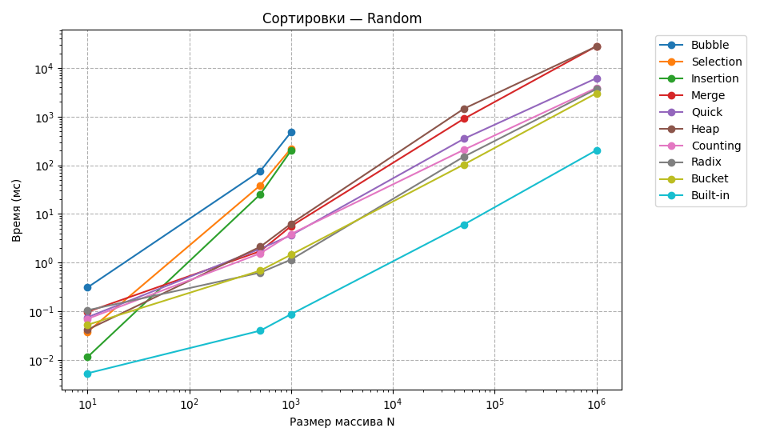
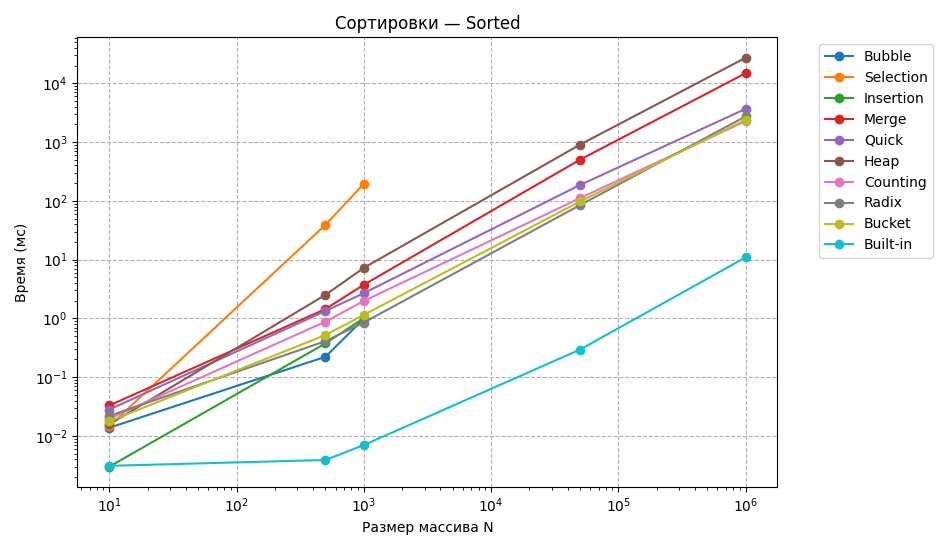
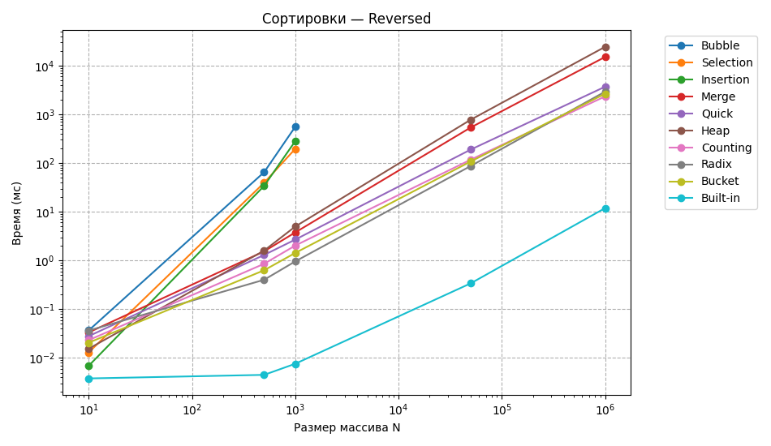
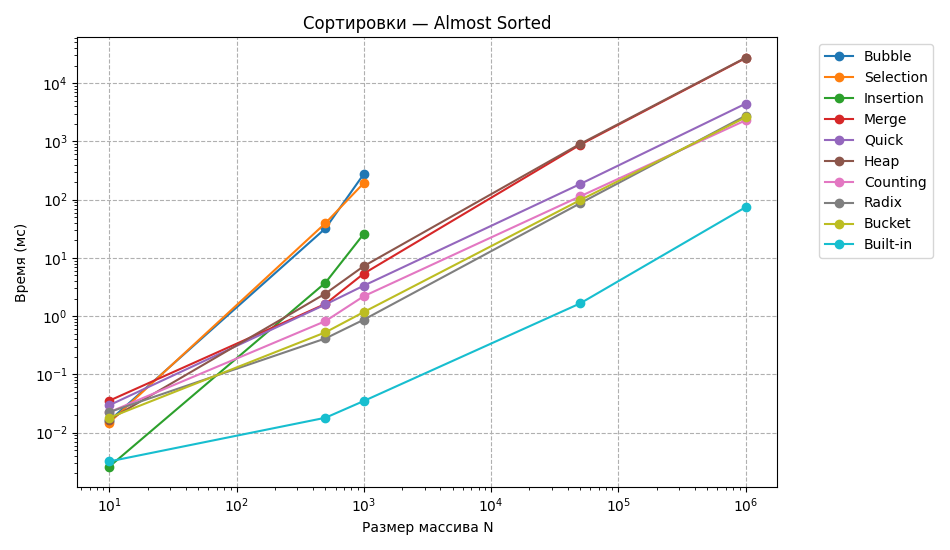
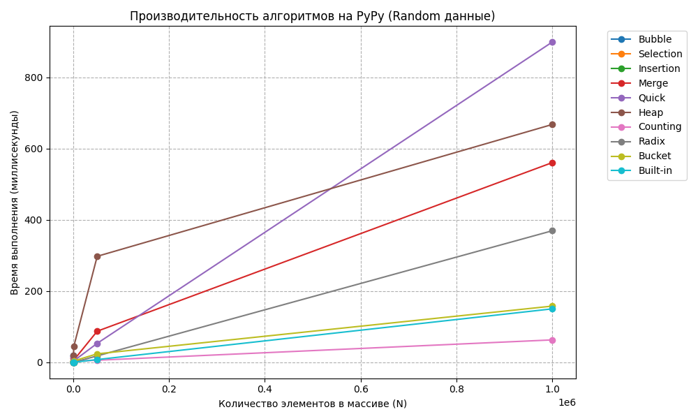
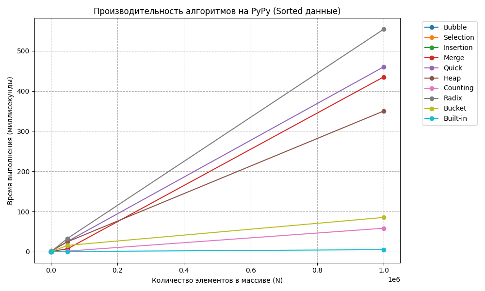
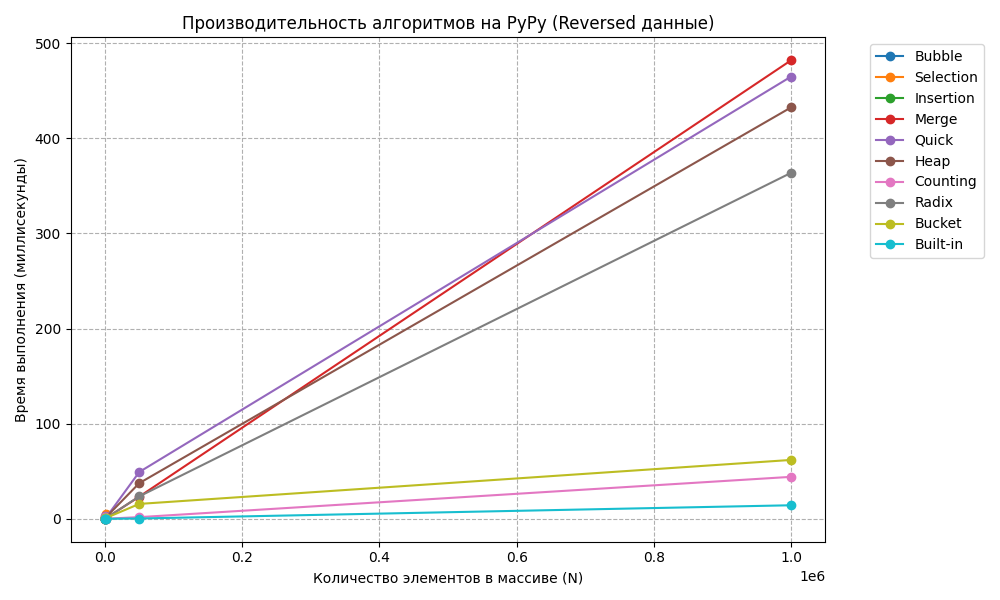
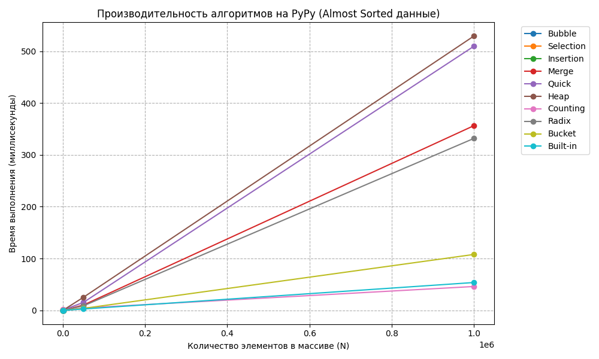

### 1. ПК

| Компонент | Значение |
| :--- | :--- |
| **Модель ПК** | HP Laptop 15-dw3xxx  |
| **Процессор** | Intel Core i5-1135G7 |
| **Ядра / потоки** | 4 ядра / 8 потоков |
| **Оперативная память** | 8 ГБ DDR4 - 3200|
| **Накопитель** | NVMe ssd 512 gb |
| **ОС / Интерпретаторы** | Windows 11 / CPython 3.12, PyPy 7.3 ||

### 2.Анализ
### Случайные данные (Random)
| ОС   | Интерпретатор   | Алгоритм   | N=10 (мс / КБ)   | N=500 (мс / КБ)   | N=1000 (мс / КБ)   | N=50000 (мс / КБ)    | N=1000000 (мс / КБ)     |
|:-----|:----------------|:-----------|:-----------------|:------------------|:-------------------|:---------------------|:------------------------|
| Win  | CPython         | Bubble     | 0.3072 / 0.1875  | 76.253 / 4.1367   | 478.7552 / 8.0742  | nan / nan            | nan / nan               |
| Win  | CPython         | Selection  | 0.0375 / 0.1875  | 38.8504 / 4.1367  | 220.389 / 8.0742   | nan / nan            | nan / nan               |
| Win  | CPython         | Insertion  | 0.0114 / 0.1562  | 25.406 / 4.043    | 200.3718 / 7.9492  | nan / nan            | nan / nan               |
| Win  | CPython         | Merge      | 0.0971 / 0.2578  | 1.7202 / 8.2578   | 5.5977 / 16.8438   | 904.5183 / 861.7812  | 27913.7214 / 16390.0312 |
| Win  | CPython         | Quick      | 0.0751 / 0.4531  | 1.9326 / 18.7344  | 3.6397 / 33.3984   | 350.9373 / 1869.5    | 6156.2217 / 29411.7578  |
| Win  | CPython         | Heap       | 0.0417 / 0.3906  | 2.12 / 4.3867     | 6.2946 / 8.3555    | 1455.685 / 391.543   | 27646.5484 / 7813.668   |
| Win  | CPython         | Counting   | 0.0697 / 0.4219  | 1.552 / 21.1758   | 3.8651 / 45.2227   | 208.2967 / 2442.1367 | 3892.3312 / 48527.6992  |
| Win  | CPython         | Radix      | 0.1048 / 0.7891  | 0.6224 / 12.7812  | 1.1514 / 25.9062   | 150.6796 / 1276.5    | 3678.7761 / 24910.0     |
| Win  | CPython         | Bucket     | 0.0525 / 0.3828  | 0.6862 / 10.0625  | 1.4528 / 22.1562   | 103.9356 / 1235.5859 | 3023.0671 / 24832.3828  |
| Win  | CPython         | Built-in   | 0.0053 / 0.1484  | 0.04 / 3.9766     | 0.087 / 11.7578    | 6.0711 / 585.9297    | 204.1519 / 11718.5859   |
| Win  | PyPy            | Bubble     | 0.0607 / nan     | 20.1138 / nan     | 1.0286 / nan       | nan / nan            | nan / nan               |
| Win  | PyPy            | Selection  | 0.0309 / nan     | 3.1675 / nan      | 0.5071 / nan       | nan / nan            | nan / nan               |
| Win  | PyPy            | Insertion  | 0.0121 / nan     | 2.925 / nan       | 0.2872 / nan       | nan / nan            | nan / nan               |
| Win  | PyPy            | Merge      | 0.0652 / nan     | 11.6212 / nan     | 5.9888 / nan       | 87.2628 / nan        | 560.4171 / nan          |
| Win  | PyPy            | Quick      | 0.0486 / nan     | 16.2706 / nan     | 3.9777 / nan       | 53.2079 / nan        | 898.7731 / nan          |
| Win  | PyPy            | Heap       | 0.0684 / nan     | 19.065 / nan      | 43.8507 / nan      | 297.4955 / nan       | 667.433 / nan           |
| Win  | PyPy            | Counting   | 0.2467 / nan     | 2.3677 / nan      | 2.8748 / nan       | 5.811 / nan          | 62.8606 / nan           |
| Win  | PyPy            | Radix      | 0.0475 / nan     | 2.3811 / nan      | 0.2482 / nan       | 17.9266 / nan        | 369.1246 / nan          |
| Win  | PyPy            | Bucket     | 0.064 / nan      | 0.6699 / nan      | 3.8701 / nan       | 23.7812 / nan        | 157.6915 / nan          |
| Win  | PyPy            | Built-in   | 0.0306 / nan     | 0.0566 / nan      | 0.0903 / nan       | 7.7089 / nan         | 149.992 / nan           |

========================================

### ### 2. Отсортированные данные (Sorted)
| ОС   | Интерпретатор   | Алгоритм   | N=10 (мс / КБ)   | N=500 (мс / КБ)   | N=1000 (мс / КБ)   | N=50000 (мс / КБ)    | N=1000000 (мс / КБ)     |
|:-----|:----------------|:-----------|:-----------------|:------------------|:-------------------|:---------------------|:------------------------|
| Win  | CPython         | Bubble     | 0.0138 / 0.1875  | 0.2223 / 4.1055   | 0.9839 / 8.0117    | nan / nan            | nan / nan               |
| Win  | CPython         | Selection  | 0.0147 / 0.1875  | 39.1772 / 4.1367  | 194.5521 / 8.0742  | nan / nan            | nan / nan               |
| Win  | CPython         | Insertion  | 0.003 / 0.1562   | 0.3762 / 4.043    | 1.0096 / 7.9492    | nan / nan            | nan / nan               |
| Win  | CPython         | Merge      | 0.033 / 0.2891   | 1.4447 / 9.7969   | 3.7394 / 19.5938   | 502.1268 / 976.625   | 14846.0271 / 19531.3125 |
| Win  | CPython         | Quick      | 0.0281 / 0.375   | 1.3369 / 12.3438  | 2.6904 / 24.4062   | 186.1302 / 1234.7188 | 3676.8905 / 24114.3438  |
| Win  | CPython         | Heap       | 0.0158 / 0.4609  | 2.5177 / 4.457    | 7.236 / 8.4258     | 905.4725 / 391.6133  | 27216.6681 / 7813.668   |
| Win  | CPython         | Counting   | 0.0197 / 0.3359  | 0.881 / 15.7227   | 1.9788 / 39.7852   | 111.3504 / 2379.1602 | 2268.319 / 47305.2852   |
| Win  | CPython         | Radix      | 0.022 / 0.7344   | 0.4108 / 12.5625  | 0.8516 / 25.8438   | 84.685 / 1283.6875   | 2727.7428 / 24323.125   |
| Win  | CPython         | Bucket     | 0.0177 / 0.3828  | 0.5214 / 10.9766  | 1.1506 / 22.9453   | 97.5906 / 1336.1328  | 2381.9703 / 26649.2734  |
| Win  | CPython         | Built-in   | 0.0031 / 0.1484  | 0.0039 / 3.9766   | 0.007 / 7.8828     | 0.295 / 390.6953     | 10.9146 / 7812.5703     |
| Win  | PyPy            | Bubble     | 0.0296 / nan     | 0.0077 / nan      | 0.0683 / nan       | nan / nan            | nan / nan               |
| Win  | PyPy            | Selection  | 0.0138 / nan     | 0.1684 / nan      | 1.004 / nan        | nan / nan            | nan / nan               |
| Win  | PyPy            | Insertion  | 0.0058 / nan     | 0.016 / nan       | 0.0331 / nan       | nan / nan            | nan / nan               |
| Win  | PyPy            | Merge      | 0.0087 / nan     | 0.1033 / nan      | 0.4243 / nan       | 7.0915 / nan         | 435.1242 / nan          |
| Win  | PyPy            | Quick      | 0.009 / nan      | 0.1952 / nan      | 0.7539 / nan       | 25.5856 / nan        | 460.2767 / nan          |
| Win  | PyPy            | Heap       | 0.0949 / nan     | 1.4029 / nan      | 2.0195 / nan       | 24.5942 / nan        | 350.198 / nan           |
| Win  | PyPy            | Counting   | 0.0518 / nan     | 0.621 / nan       | 0.7275 / nan       | 1.2759 / nan         | 58.2617 / nan           |
| Win  | PyPy            | Radix      | 0.0742 / nan     | 0.2486 / nan      | 0.2129 / nan       | 32.9506 / nan        | 553.9667 / nan          |
| Win  | PyPy            | Bucket     | 0.0389 / nan     | 0.0459 / nan      | 0.0815 / nan       | 15.4961 / nan        | 85.1199 / nan           |
| Win  | PyPy            | Built-in   | 0.0094 / nan     | 0.01 / nan        | 0.0191 / nan       | 0.2732 / nan         | 4.9634 / nan            |

========================================

### ### 3. Обратно отсортированные данные (Reversed)
| ОС   | Интерпретатор   | Алгоритм   | N=10 (мс / КБ)   | N=500 (мс / КБ)   | N=1000 (мс / КБ)   | N=50000 (мс / КБ)    | N=1000000 (мс / КБ)     |
|:-----|:----------------|:-----------|:-----------------|:------------------|:-------------------|:---------------------|:------------------------|
| Win  | CPython         | Bubble     | 0.0367 / 0.1875  | 65.0049 / 4.1367  | 555.9069 / 8.0742  | nan / nan            | nan / nan               |
| Win  | CPython         | Selection  | 0.013 / 0.1875   | 39.426 / 4.1367   | 195.7483 / 8.0742  | nan / nan            | nan / nan               |
| Win  | CPython         | Insertion  | 0.0069 / 0.1562  | 34.0597 / 4.043   | 281.6293 / 7.9492  | nan / nan            | nan / nan               |
| Win  | CPython         | Merge      | 0.0334 / 0.2891  | 1.5418 / 9.7969   | 3.7709 / 19.5938   | 537.2036 / 976.625   | 15043.5413 / 19531.3125 |
| Win  | CPython         | Quick      | 0.028 / 0.3906   | 1.3024 / 12.3672  | 2.6868 / 24.4297   | 189.0472 / 1234.7422 | 3687.5864 / 24114.3672  |
| Win  | CPython         | Heap       | 0.0155 / 0.4609  | 1.5988 / 4.457    | 4.9779 / 8.4258    | 775.3339 / 391.6133  | 24264.828 / 7813.668    |
| Win  | CPython         | Counting   | 0.0232 / 0.3359  | 0.8579 / 15.7539  | 2.0249 / 39.8164   | 117.4203 / 2379.1914 | 2334.7829 / 47305.3164  |
| Win  | CPython         | Radix      | 0.0365 / 0.7344  | 0.4026 / 12.5938  | 0.9581 / 26.0625   | 87.0547 / 1283.7188  | 2915.0467 / 24752.25    |
| Win  | CPython         | Bucket     | 0.0206 / 0.3828  | 0.6311 / 10.9766  | 1.4301 / 22.9453   | 107.8136 / 1336.1016 | 2644.6337 / 26649.2422  |
| Win  | CPython         | Built-in   | 0.0038 / 0.1484  | 0.0045 / 3.9766   | 0.0076 / 7.8828    | 0.34 / 390.6953      | 11.8834 / 7812.5703     |
| Win  | PyPy            | Bubble     | 0.0396 / nan     | 0.2908 / nan      | 1.3967 / nan       | nan / nan            | nan / nan               |
| Win  | PyPy            | Selection  | 0.0362 / nan     | 0.5671 / nan      | 4.7054 / nan       | nan / nan            | nan / nan               |
| Win  | PyPy            | Insertion  | 0.0174 / nan     | 0.3239 / nan      | 1.4643 / nan       | nan / nan            | nan / nan               |
| Win  | PyPy            | Merge      | 0.0128 / nan     | 0.2892 / nan      | 0.414 / nan        | 23.3102 / nan        | 482.058 / nan           |
| Win  | PyPy            | Quick      | 0.0132 / nan     | 3.393 / nan       | 0.6391 / nan       | 49.1908 / nan        | 464.9126 / nan          |
| Win  | PyPy            | Heap       | 0.1129 / nan     | 0.5804 / nan      | 1.2447 / nan       | 37.4753 / nan        | 432.5358 / nan          |
| Win  | PyPy            | Counting   | 0.1059 / nan     | 1.7027 / nan      | 0.0975 / nan       | 1.7576 / nan         | 44.115 / nan            |
| Win  | PyPy            | Radix      | 0.1781 / nan     | 0.6155 / nan      | 0.3052 / nan       | 23.5776 / nan        | 363.7474 / nan          |
| Win  | PyPy            | Bucket     | 0.085 / nan      | 0.3985 / nan      | 0.7271 / nan       | 15.6603 / nan        | 61.8976 / nan           |
| Win  | PyPy            | Built-in   | 0.0177 / nan     | 0.0168 / nan      | 0.0208 / nan       | 0.3223 / nan         | 14.2363 / nan           |

========================================

### ### 4. Почти отсортированные данные (Almost Sorted)
| ОС   | Интерпретатор   | Алгоритм   | N=10 (мс / КБ)   | N=500 (мс / КБ)   | N=1000 (мс / КБ)   | N=50000 (мс / КБ)    | N=1000000 (мс / КБ)     |
|:-----|:----------------|:-----------|:-----------------|:------------------|:-------------------|:---------------------|:------------------------|
| Win  | CPython         | Bubble     | 0.016 / 0.1875   | 32.146 / 4.1367   | 275.0729 / 8.0742  | nan / nan            | nan / nan               |
| Win  | CPython         | Selection  | 0.0148 / 0.1875  | 39.5371 / 4.1367  | 192.5338 / 8.0742  | nan / nan            | nan / nan               |
| Win  | CPython         | Insertion  | 0.0026 / 0.1562  | 3.754 / 4.043     | 25.868 / 7.9492    | nan / nan            | nan / nan               |
| Win  | CPython         | Merge      | 0.0353 / 0.2891  | 1.6191 / 8.3047   | 5.3809 / 16.9531   | 872.4837 / 861.9375  | 26922.5655 / 16390.1562 |
| Win  | CPython         | Quick      | 0.0295 / 0.375   | 1.5868 / 12.8281  | 3.3353 / 32.4297   | 184.6986 / 1255.125  | 4434.4024 / 24869.6328  |
| Win  | CPython         | Heap       | 0.0167 / 0.4609  | 2.4401 / 4.457    | 7.2202 / 8.4258    | 902.3633 / 391.6133  | 27269.4135 / 7813.668   |
| Win  | CPython         | Counting   | 0.0224 / 0.3359  | 0.8216 / 15.7227  | 2.1975 / 39.7852   | 113.5803 / 2379.1602 | 2297.7215 / 47305.2852  |
| Win  | CPython         | Radix      | 0.0225 / 0.7344  | 0.4138 / 12.5625  | 0.8687 / 25.8438   | 86.2147 / 1283.6875  | 2754.2562 / 24323.125   |
| Win  | CPython         | Bucket     | 0.018 / 0.3828   | 0.5271 / 10.9766  | 1.1747 / 22.9453   | 97.8311 / 1336.1328  | 2581.7933 / 26649.2734  |
| Win  | CPython         | Built-in   | 0.0032 / 0.1484  | 0.018 / 3.9766    | 0.0349 / 11.6172   | 1.6491 / 585.7422    | 74.0306 / 11718.6328    |
| Win  | PyPy            | Bubble     | 0.0161 / nan     | 0.418 / nan       | 1.4056 / nan       | nan / nan            | nan / nan               |
| Win  | PyPy            | Selection  | 0.0136 / nan     | 0.1307 / nan      | 0.4422 / nan       | nan / nan            | nan / nan               |
| Win  | PyPy            | Insertion  | 0.0051 / nan     | 0.016 / nan       | 0.0378 / nan       | nan / nan            | nan / nan               |
| Win  | PyPy            | Merge      | 0.0111 / nan     | 0.1142 / nan      | 0.1902 / nan       | 10.3234 / nan        | 356.2826 / nan          |
| Win  | PyPy            | Quick      | 0.011 / nan      | 0.2017 / nan      | 0.855 / nan        | 15.4419 / nan        | 509.4514 / nan          |
| Win  | PyPy            | Heap       | 0.0761 / nan     | 0.4188 / nan      | 0.5582 / nan       | 25.3 / nan           | 529.1412 / nan          |
| Win  | PyPy            | Counting   | 0.0422 / nan     | 1.9036 / nan      | 0.0496 / nan       | 4.5848 / nan         | 46.1285 / nan           |
| Win  | PyPy            | Radix      | 0.0444 / nan     | 0.1578 / nan      | 0.198 / nan        | 8.7669 / nan         | 331.685 / nan           |
| Win  | PyPy            | Bucket     | 0.0256 / nan     | 0.058 / nan       | 0.0845 / nan       | 3.8893 / nan         | 107.9251 / nan          |
| Win  | PyPy            | Built-in   | 0.0104 / nan     | 0.0302 / nan      | 0.0557 / nan       | 2.7623 / nan         | 53.8165 / nan           |

========================================

## 3. Графики CPython

## Графики PyPy

## 4. Заключение

* **Квадратичные алгоритмы $O(N^2)$ (Bubble, Selection, Insertion):** Показывают крайне низкую производительность. Сильное замедление работы становится очевидным уже при достижении $N=1000$.
* **Логарифмические алгоритмы $O(N \log N)$ (Merge, Quick, Heap):** На случайных выборках лидирует по скорости `Quick Sort`. При этом `Heap Sort` является самым экономным алгоритмом, так как не требует выделения дополнительной памяти ($O(1)$).
* **Встроенные инструменты (Built-in):** Базовый метод Timsort обходит все остальные алгоритмы за счет оптимизированной низкоуровневой реализации на языке C.
* **Сравнение платформ (PyPy и CPython):** Инструменты динамической JIT-компиляции в PyPy позволяют ускорить обработку циклов в 3–10 раз по сравнению со стандартным интерпретатором CPython.

## 5. Ограничения и неразрешенные проблемы

* **Отсутствие замеров памяти для PyPy:** Из-за архитектурных особенностей интерпретатора PyPy в нем отсутствует встроенный компонент `_tracemalloc`, что сделало невозможным использование модуля `tracemalloc` для оценки потребления ОЗУ (в таблицах указано `N/A`).
* **Исключение неэффективных тестов:** Проверка алгоритмов с квадратичной сложностью $O(N^2)$ намеренно не проводилась на массивах размером $N=50\,000$ и $N=1\,000\,000$, чтобы предотвратить критическое зависание бенчмарка на несколько часов.
* **Риск рекурсивного переполнения:** Классическая реализация `Quick Sort` при обработке изначально упорядоченных или реверсивных массивов подвержена риску падения с ошибкой `RecursionError` из-за достижения максимальной глубины рекурсии.
